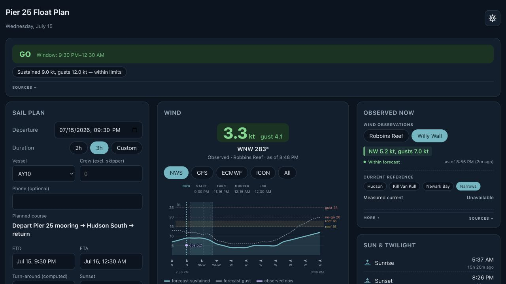

# Pier 25 Float Plan

Pier 25 Float Plan combines wind, current, weather, advisories, radar, and sail simulation to support planning a Hudson River day sail from the Pier 25 mooring field.

[Open the live dashboard](https://gm2211.github.io/floatplan/)

This app is planning support only. It is not a navigation tool or a substitute for seamanship, current observations, official forecasts, or onboard judgment.
